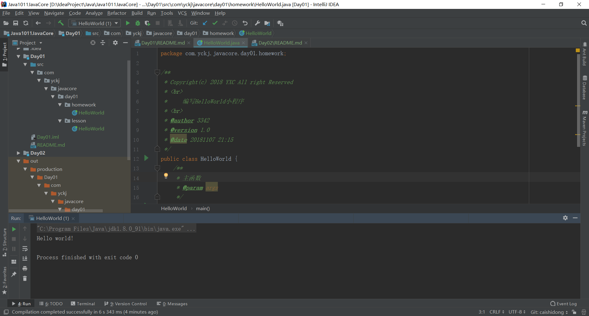
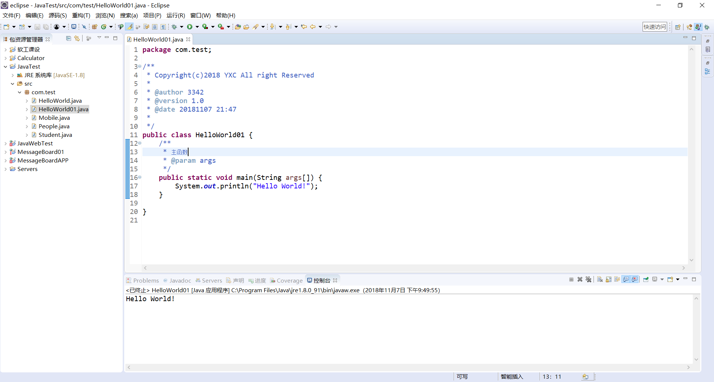
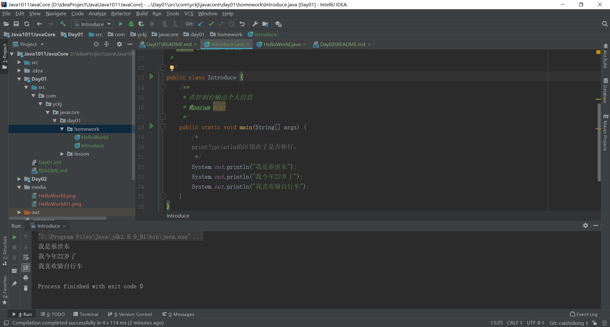
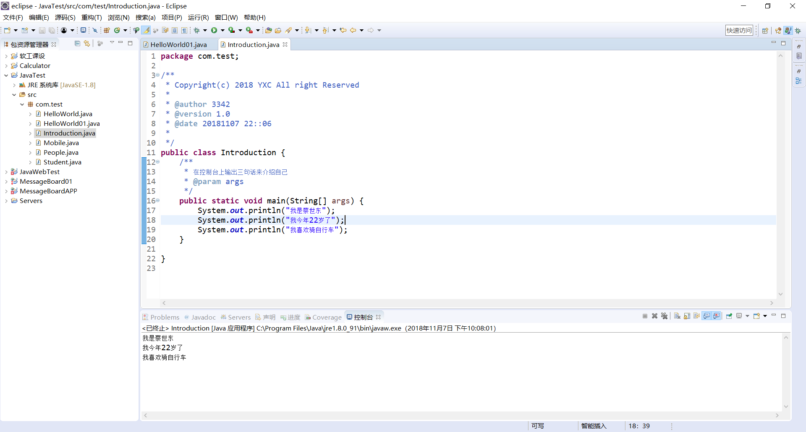

# Day01 知识总结
- Java的历史以及发明者
- 编程语言的分类
- Java的十个特性
- 关于跨平台的理解以及为什么说C语言不能跨平台的原因
- 使用dos命令进行编译、执行
# 课后作业
1、JDK，JRE，JVM分别是什么?有什么关系？各自有什么作用？做总结理解。

	JDK: Java Development Kit --- 软件开发工具包
	JRE: Java Runtime Environment -- Java运行环境
	JVM: Java虚拟机 ----> Java Virtual Machine
	JDK包含JRE,通过各个平台特有的JVM，Java可以实现一次编译，到处执行的跨平台功能。

2、Java语言是跨平台的吗？JVM是跨平台的吗？
``` 
	Java语言是跨平台的，JVM不跨平台！
```
3、自己能够独立编写一个HelloWorld程序，并且编译运行成功。
```
    代码详见Day01/src/com/yckj/javacore/day01/homework/HelloWorld.java
```
 
4、使用Eclipse和IDEA分别编写一个HelloWorld程序，并且编译运行成功。
``` 
    IDEA生成的*.class文件详见
    out/production/Day01/com/yckj/javacore/day01/homework/HelloWorld.class
```

<hr>

 
5、使用两种开发工具在控制台输出三句话介绍自己（要求写注释）：
我的名字是XXX!
我今年多大了
我喜欢什么

```
    代码详见Day01/src/com/yckj/javacore/day01/homework/Introduce.java
```

<hr>
