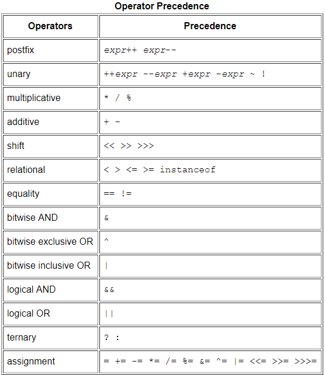

# 运算符、控制台交互式编程、包路径知识总结
## 运算符
#### 关系运算符
|运算符 |描述 |
|:---:|:---:|
| == | 等于|
|!= |不等于|
|  > | 大于 |
| < | 小于 |
| >= | 大于等于|
| <= | 小于等于 |
- 关系运算符运算产生的结果为布尔类型，常用于if语句以及各种循环控制语句当中.
- 任何Java中的数据类型都可以参与关系运算（boolean类型只能使用==与!=），产生一个布尔类型结果。

#### 逻辑运算符
| 序号 | 运算符 | 描述                                 |
| ---- | ------ | ------------------------------------ |
| 1    | !      | 逻辑取反                             |
| 2    | &      | 逻辑与运算                           |
| 3    | \|     | 逻辑或运算                           |
| 4    | &&     | 逻辑短路与                           |
| 5    | \|\|   | 逻辑短路或                           |
| 6    | ^      | 逻辑异或运算                         |
| 7    | &=     | 逻辑与运算并赋值                     |
| 8    | \|=    | 逻辑或运算并赋值                     |
| 9    | ^=     | 逻辑异或运算并赋值                   |
| 10   | ? ：   | 三目运算符（三元运算符）if-then-else |
- &和&&的区别：
&：无论左边表达式结果是true还是false，右边都要参与运算。
&&:(短路与) 当左边表达式为false时，右边不参与运算。
- |与||的区别类似
- 三目运算符？前面的表达式为真则执行 ：前面的表达式，否则执行 ：后面的表达式。
#### 位运算符
- 适合的数据类型：long、int、short、byte、char。
- 操作的都是补码。
- 正数的原码、反码、补码都不变；负数的补码：符号位和最后一位不变，其余位取反；
或者取反加一。负数的反码：符号位不变，按位取反。
- 按位取反~ 会自动提升数据类型。
-  \>\> 和 >>> 的区别：
    前者高位空出的位置补原来符号位的数字；简称有符号右移；
    后者高位空出的位置一律补0；简称无符号右移。
    对于正数来说，两者并没有什么区别；但是对于负数来说，变化非常大。
#### 运算符的优先级
- 一元运算符>算术运算符>位运算符>关系运算符>逻辑运算符>赋值运算符
- 详情请看图：

##  控制台交互式编程
- 使用 java.util.Scanner 以后记得释放资源。
- 对于空格、Tab、回车这些特殊的符号，在控制台是无法输入被程序读取的。
- next()和nextLine()的区别：
前者不能带空白字符（空格、制表符等），后者可以。
- System.in代表的是系统的标准输入设备；System.out代表的是系统的标准输出设备。

## 包路径
- 在Java中java.lang包下的类是不需要显示导入的，JVM默认会为我们导入，可以直接使用。
##### JDK中的常用包介绍
- java.lang:核心包，不需要导入，直接使用。
- java.sql：支持数据库操作。
- java.text：提供以与自然语言无关的方式来处理文本、日期、数字和消息的类和接口。
- java.util：Java实用工具包。
- java.io：支持文件读写。
- javax.sql：对数据库操作的扩展包。
- java.awt：支持图形界面程序开发（现在不怎么用）。
- java.swing：支持图形界面程序开发（现在不怎么用）。

- 注：java开头的包是java基础包，javax开头的包是java扩展包。

